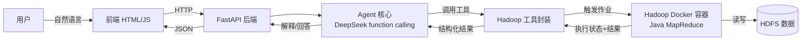

# 迭代一 执行规划（Hadoop 数据清洗与 Agent 基础）

> **文档维护约定**：本项目通过以下文档持续记录进展，每次工作后实时更新：
> - `README.md` —— 项目入口：结构、使用教程、进度、真实结果
> - `docs/问题日志.md` —— 踩坑与解决方案（按时间倒序）
> - `docs/执行规划.md`（本文件）—— 阶段规划与依赖
> - `docs/阶段1_评分方案与清洗规则.md` / `docs/阶段7_时间边界与版本管理.md` —— 方案定稿

## 1. 技术选型（已确认）

| 组件 | 选型 | 理由 |
| --- | --- | --- |
| 大数据框架 | Hadoop（Docker 容器，单节点伪分布式） | 绕开本机 Java 23 不兼容；环境可复现 |
| 计算引擎 | Java MapReduce（Maven 构建） | 最贴合"Hadoop 数据清洗"主题 |
| Agent | DeepSeek API（function calling） | 真 LLM Agent，国内可用 |
| 后端 | FastAPI（Python） | 便于调 LLM 与触发 hadoop 命令 |
| 前端 | 原生 HTML/JS（由 FastAPI 托管） | 无构建步骤，够用 |
| 数据 | ml-1m（movies/ratings/users） | 课程给定 |

## 2. 总体架构



## 3. 目录结构

```
lab2/
├── ml-1m/               # 原始数据（只读，不改动）
├── data/
│   ├── raw/             # 原始数据副本（供 Hadoop 读取）
│   ├── cleaned/         # 清洗后数据（带版本）
│   └── reports/         # 评估报告（JSON/MD）
├── src/
│   ├── hadoop/          # Java MapReduce 作业（Maven 工程）
│   ├── agent/           # Agent 核心、工具定义、DeepSeek 封装
│   ├── backend/         # FastAPI 应用
│   └── frontend/        # 前端页面（HTML/JS/CSS）
├── config/              # 清洗规则、评分配置、T1/T2
├── docs/                # 文档
└── scripts/             # 启动/一键运行脚本
```

## 4. 阶段划分与依赖

| 阶段 | 内容 | 产出 | 依赖 |
| --- | --- | --- | --- |
| 0 数据探查 | 分析三文件真实质量问题 | 问题清单 | 无 |
| 1 方案定稿 | 五维评分公式 + 清洗规则 | config 配置 | 阶段0 |
| 2 Hadoop 环境 | Docker 起单节点 Hadoop | 可运行集群 | 无 |
| 3 MapReduce | 清洗前评分/清洗/清洗后评分 | jar 包 | 阶段1、2 |
| 4 Agent | DeepSeek function calling + 工具封装 | agent 模块 | 阶段3 |
| 5 后端 | FastAPI 接口 | backend 模块 | 阶段4 |
| 6 前端 | 页面 | frontend 模块 | 阶段5 |
| 7 版本边界 | T1/T2 + 版本登记 | config | 阶段0 |
| 8 联调文档 | 全链路测试 + 文档 | 交付物 | 全部 |

## 5. 五维评分方案（建议，待定稿）

评分统一口径：每维 0–100 分，记录级判定 + 数据集级汇总。清洗前后用同一公式。

| 维度 | 衡量方式 | 公式要点 |
| --- | --- | --- |
| Accurate | 字段值是否合法/在合理范围 | 合法记录数 / 总记录数 |
| Complete | 必填字段是否非空 | 非空字段数 / 应存在字段数 |
| Unique | 是否重复 | 1 − 重复记录数 / 总记录数 |
| Up-to-date | 时间戳是否在覆盖范围 | 合法时间戳记录占比 |
| Consistent | 格式/单位/跨表是否一致 | 一致记录数 / 总记录数 |

清洗规则三类处置：修复（改）、去重（删重复）、隔离（标记不删）。

## 6. T1/T2（建议，待数据探查后定）

- T1：训练期截止时间；T2：验证期截止时间；T2 之后为测试集。
- 需先探查 ratings.dat 时间戳分布（约 2000-04 ~ 2003-02），再选具体边界。

## 7. 版本管理

- 数据版本：如 `v1.0`
- 清洗规则版本：如 `rules-v1.0`
- 评分配置版本：如 `scoring-v1.0`
- 任务标识：每次任务生成 UUID
- 上述信息随评估报告一并落盘。

## 8. 风险与应对

| 风险 | 应对 |
| --- | --- |
| Java 23 与 Hadoop 不兼容 | 用 Docker，Java 在容器内 |
| Docker 拉镜像慢 | 提前下载，或配国内镜像源 |
| HDFS 首次启动失败 | 先 format namenode；检查端口占用 |
| DeepSeek API 偶发失败 | Agent 内加重试 + 明确失败状态返回 |
| 前端样式简陋 | 不追求美观，保证功能与结果一致 |
