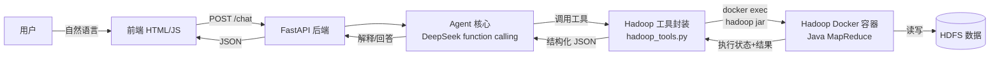

# MovieLens 数据治理 Agent —— 系统说明与交付文档（迭代一）

> 对应课程要求：迭代一提交内容中的「相关文档」。
> 涵盖：系统说明、运行方法、工具接口、数据与版本、实验配置、评价结果、已知限制。

---

## 1. 系统概述

本系统是一个由 **Agent 驱动** 的 MovieLens 1M 数据治理系统。用户在前端输入自然语言请求，
Agent（基于 DeepSeek 大模型的 function calling）自动理解意图，调用 Hadoop MapReduce
工具完成 **数据检查 → 清洗前评分 → 数据清洗 → 清洗后评分 → 结果对照与解释** 的完整流程，
全程无需用户手动运行 Hadoop 命令、上传中间文件或逐阶段点击按钮。

### 1.1 技术栈

| 组件 | 选型 | 说明 |
| --- | --- | --- |
| 大数据框架 | Hadoop 3.4.1 | Docker 容器，单节点伪分布式 |
| 计算引擎 | Java MapReduce | Maven 构建，编译 target 1.8 |
| Agent | DeepSeek API（function calling） | OpenAI 兼容接口 |
| 后端 | FastAPI（Python 3.13） | 托管前端 + /chat 等接口 |
| 前端 | 原生 HTML/JS + Chart.js + marked | 无构建步骤 |
| 数据 | ml-1m | movies / ratings / users 三表 |

### 1.2 总体架构



---

## 2. 运行方法

详见项目根目录 `README.md` 第 4 节「快速开始」。核心步骤：

```powershell
# ① 打开 Docker Desktop，等就绪
# ② 项目根目录启动 Hadoop：
docker-compose up -d
# ③ 启动后端（自动定位 Python 与项目目录）：
powershell -ExecutionPolicy Bypass -File scripts\start-backend.ps1
# ④ 浏览器打开 http://127.0.0.1:8000/
```

前置条件：`config/secrets.env` 中已配置 `DEEPSEEK_API_KEY`。
首次使用需：`pip install -r requirements.txt`、编译 jar（`mvn package`）、上传原始数据到 HDFS。
完整初始化流程见 README 4.0 节。

---

## 3. 工具接口说明

Agent 通过 function calling 暴露以下工具，均为「封装 Hadoop 能力」的可调用接口：

| 工具 | 参数 | 功能 | 对应 MapReduce |
| --- | --- | --- | --- |
| `score_data` | `input_path`, `output_path` | 对数据做五维质量评分，返回得分+计数 | `lab2.ScoreJob` |
| `clean_data` | `input_path`, `output_path` | 清洗（修复/去重/隔离），返回处置统计 | `lab2.CleanJob` |
| `read_quarantine_samples` | `output_path`, `limit` | 读取隔离记录样例 | （读 HDFS） |

### 3.1 工具实现机制

每个工具内部通过 `subprocess` 执行 `docker exec lab2-hadoop sh -c "hadoop jar ..."`，
触发容器内的 MapReduce 作业，再从 HDFS 读回结构化 JSON。**Agent 不直接接触数据，
清洗与评分实际由 Hadoop 执行**，满足题目要求。

### 3.2 MapReduce 作业

| 类 | 职责 |
| --- | --- |
| `DataRules` | 共享规则：合法编码集、时间戳范围、T1/T2、字段判定 |
| `ReferenceTables` | 加载合法 ID 集合，用于跨表一致性检查 |
| `ScoreJob` | 五维评分（计数作业 + 去重作业），输出 `report.json` |
| `CleanJob` | 清洗（修复/去重/隔离），输出分目录数据 + `summary.json` |

### 3.3 后端 HTTP 接口

| 端点 | 方法 | 说明 |
| --- | --- | --- |
| `/chat` | POST | 自然语言请求，返回 Agent 回答 + 工具调用步骤 |
| `/health` | GET | 健康检查 + key 配置状态 |
| `/report` | GET | 完整评估报告（评分/统计/版本/T1T2） |
| `/samples` | GET | 清洗后数据样例 + 隔离样例 + 记录数 |
| `/` | GET | 前端页面 |

---

## 4. 数据与版本管理

### 4.1 数据规模

| 文件 | 声明规模 | 实际行数（含注入脏数据） |
| --- | --- | --- |
| ratings.dat | 1,000,209 | 1,150,241 |
| users.dat | 6,040 | 6,946 |
| movies.dat | 3,883 | 4,465 |

> 实际文件被人为注入了约 15 万条脏数据，这正是本系统需要清洗的对象。

### 4.2 版本信息

| 产物 | 版本号 |
| --- | --- |
| 原始数据 | `raw-v1.0` |
| 清洗后数据 | `cleaned-v1.0` |
| 清洗规则 | `rules-v1.0` |
| 评分配置 | `scoring-v1.0` |
| 时间边界 | `timeboundary-v1.0` |

版本信息随评估报告（`/report`）一并输出，供后续迭代复用。

### 4.3 时间边界 T1/T2

| 边界 | 取值 | 时间戳（UTC 秒） | 用途 |
| --- | --- | --- | --- |
| T1 | 2000-12-31 23:59:59 | 978307199 | 训练期截止 |
| T2 | 2001-12-31 23:59:59 | 1009843199 | 验证期截止 |

T2 之后为测试期。后续迭代不得混用不同时间段的数据构造训练输入。

---

## 5. 实验配置

### 5.1 五维评分方案（scoring-v1.0）

统一口径：每维 0–100 分，清洗前后用**完全相同**的公式，保证可比。

| 维度 | 衡量定义 | 公式 |
| --- | --- | --- |
| Accurate | 字段值是否真实合法 | 合法记录数 / 总记录数 × 100 |
| Complete | 必填字段是否非空 | 非空字段数 / 应存在字段总数 × 100 |
| Unique | 业务记录是否唯一 | (1 − 重复记录数 / 总记录数) × 100 |
| Up-to-date | 时间戳是否在覆盖范围 | 合法时间戳记录 / 应有时效性记录 × 100 |
| Consistent | 格式/单位/跨表是否一致 | 一致记录数 / 总记录数 × 100 |

综合分 = 加权平均：Accurate 0.25、Complete 0.25、Unique 0.20、Consistent 0.20、Up-to-date 0.10。

**设计依据**：准确性/完整性直接决定可用性，权重最高；时效性受数据集本身年代限制（2003 年发布），改善空间有限，权重最低。

### 5.2 清洗规则（rules-v1.0）

三类处置：**修复（fix）**、**去重（dedup）**、**隔离（quarantine）**。

| 编号 | 问题 | 处置 |
| --- | --- | --- |
| R1 | 分隔符异常（逗号/竖线/冒号） | 修复为 `::` |
| R2 | 字段数错误 | 修复（丢弃 EXTRA_FIELD）或隔离 |
| R3 | 评分非整数/越界/空 | 隔离 |
| R4 | 时间戳毫秒级 | 修复（÷1000 转秒） |
| R5 | 时间戳超范围/非法 | 隔离 |
| R6 | 完全重复记录 | 去重 |
| R7 | 同键不同值冲突 | 隔离 |
| R8 | 编码非法（Gender=X、Age=30、Occ=99、UnknownGenre） | 隔离 |
| R9 | 空字段/空标题 | 隔离 |
| R10 | 跨表引用不存在 | 隔离 |
| R11 | 时间戳缺失 | 隔离 |
| R12 | 标题无年份/异常 | 隔离 |

---

## 6. 评价结果（真实运行结果）

### 6.1 五维评分对比

| 维度 | 清洗前 | 清洗后 | 变化 |
| --- | --- | --- | --- |
| Accurate | 94.12 | 100.0 | +5.88 |
| Complete | 97.65 | 100.0 | +2.35 |
| Unique | 92.04 | 100.0 | +7.96 |
| Up-to-date | 96.32 | 100.0 | +3.68 |
| Consistent | 96.43 | 100.0 | +3.57 |
| **Overall** | **95.27** | **100.0** | **+4.73** |

### 6.2 数据量变化（账目精确对平）

```
清洗前总量 1,161,652
  = 清洗后 1,005,855  (ratings 996,113 + users 5,895 + movies 3,847)
  + 隔离 155,503      (直接隔离 104,987 + 冲突 50,516)
  + 去重 294          (完全重复，保留一条)
```

| 处置类型 | 条数 |
| --- | --- |
| 修复 (fix) | 9,897 |
| 去重 (dedup) | 294 |
| 隔离 (quarantine) | 104,987 |
| 冲突 (conflict) | 50,516 |

### 6.3 发现的主要脏数据类型

- 评分：`3.5`、`five`、`0`、`6`（非整数/越界）
- 时间戳：毫秒级（`978153540000`）、负值（`-1`）、超范围（`4102444800`）
- 分隔符：逗号、竖线、单冒号混用
- 编码：`Gender=X`、`Age=30`、`Occupation=99`、`UnknownGenre`
- 跨表：引用不存在的 UserID/MovieID

---

## 7. 已知限制

1. **隔离 ≠ 修复**：155,503 条隔离/冲突记录被移出主数据集单独存放，其数据问题本身未解决，待人工复核。
2. **满分是「幸存者偏差」**：清洗后五维满分，仅代表「在既定规则下、对保留记录」达标，主要贡献来自「剔除」而非「修好」。
3. **格式正确 ≠ 内容真实**：规则只能校验格式/范围/唯一性，无法判断评分是否真实反映用户偏好（如刷分、误点）。
4. **时效性受年代限制**：数据为历史数据集（2000–2003），Up-to-date 满分仅指「时间戳格式合规」，不代表反映当前状态。
5. **无多版本快照**：HDFS 只保留最新一份产物，历史版本需通过下载报告手动归档。
6. **冲突记录未裁决**：同键不同值的 50,516 条记录被标记但未判定哪条为真，需人工介入。
7. **用户属性未经核验**：`users.dat` 中年龄/职业等由用户自愿填写，格式合法不代表内容准确。

---

## 8. 提交内容清单

| 提交项 | 位置 | 状态 |
| --- | --- | --- |
| 源码（MapReduce/Agent/后端/前端/配置/脚本） | `src/`、`config/`、`scripts/`、`docker-compose.yml` | ✅ |
| 依赖清单 | `requirements.txt` | ✅ |
| Git 忽略规则 | `.gitignore` | ✅ |
| 后端启动脚本 | `scripts/start-backend.ps1` | ✅ |
| 系统说明与交付文档（本文件） | `docs/系统说明与交付文档.md` | ✅ |
| 问题日志 | `docs/问题日志.md` | ✅ |
| 方案定稿（评分/清洗/时间边界） | `docs/阶段1_*.md`、`docs/阶段7_*.md` | ✅ |
| 项目 README（运行方法） | `README.md` | ✅ |

> 注：`config/secrets.env`（含 API key）在 `.gitignore` 中，**不会**随仓库上传；已提供 `config/secrets.env.example` 作为模板。
