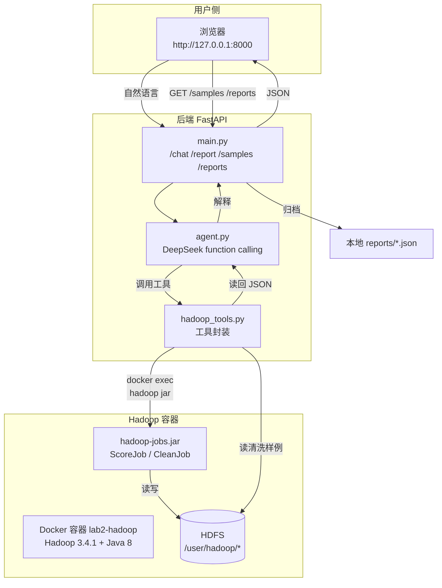
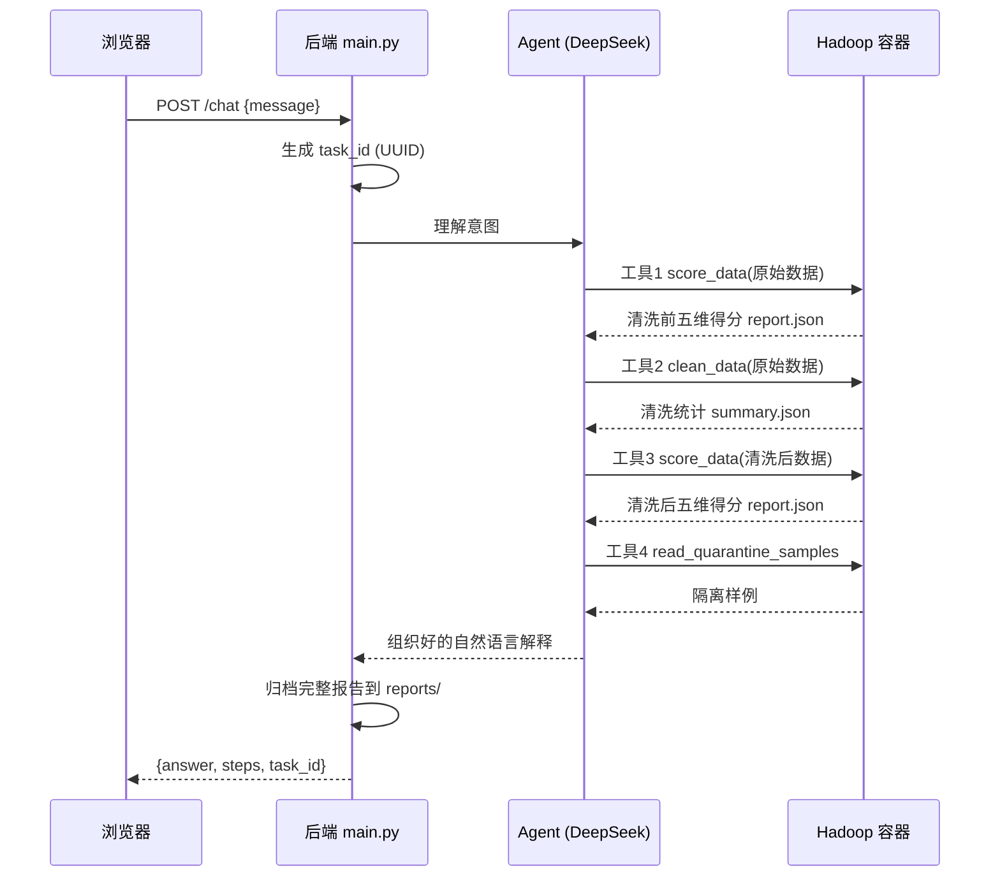

# MovieLens 数据治理 Agent —— 项目详解（迭代一）

> 本文档是《系统说明与交付文档》的**深度补充**，面向"要演示、要应对老师提问"的场景。
> 内容：项目框架、运行流程、核心文件作用、启动命令含义、前端功能、设计方案与选择理由、reports JSON 字段解读、常见提问。

---

## 1. 项目到底做了什么（一句话）

用户在前端输入一句自然语言，Agent（DeepSeek 大模型）自动调用 Hadoop MapReduce 作业，完成
**原始数据检查 → 清洗前五维评分 → 数据清洗 → 清洗后五维评分 → 结果对照与解释**，
全程无需手动跑 Hadoop 命令、上传文件或点按钮。

---

## 2. 系统架构全景



**三层职责分工**：

| 层 | 角色 | 负责什么 |
| --- | --- | --- |
| Hadoop 容器 | 「手」 | 真正执行数据清洗和评分计算（MapReduce） |
| Agent + 后端 | 「脑」 | 理解意图、编排工具调用、解释结果 |
| 前端 | 「脸」 | 展示结果、接受输入、支持追问 |

---

## 3. 一次完整请求的数据流（时序）

以用户说「请清洗并评估」为例，系统内部发生的事：



**关键点**：Agent 不是一次性算完，而是**一轮一轮地和 LLM 对话**，每轮决定"下一步调用哪个工具"，直到它认为任务完成、给出最终文字回答。这就是 function calling 的机制。

---

## 4. 核心文件作用详解

### 4.1 Java MapReduce（`src/hadoop/`）

| 文件 | 作用 | 细节 |
| --- | --- | --- |
| `DataRules.java` | **共享规则库** | 定义合法编码集（性别 M/F、年龄 7 档、职业 0~20、电影类型 18 种）、时间戳合法范围、T1/T2 常量、字段合法性判定函数。**评分和清洗都调用它**，保证"同一套口径"。 |
| `ReferenceTables.java` | 合法 ID 加载器 | 从 users.dat / movies.dat 提取合法 ID 集合，供跨表一致性检查（评分引用的用户/电影是否存在）。 |
| `ScoreJob.java` | 五维评分作业 | 跑 2 个 MapReduce：① 计数（统计五维各通过多少条）② 去重（统计重复条数）。Driver 汇总后算出 0~100 的五维得分，写 `report.json`。 |
| `CleanJob.java` | 数据清洗作业 | Mapper 逐条修复/隔离，Reducer 按业务键去重/冲突隔离。输出 `ratings/ users/ movies/ quarantine/` 分目录 + `summary.json`。 |
| `pom.xml` | Maven 配置 | 编译为 Java 8 字节码（因为 Hadoop 容器里是 Java 8）。 |

### 4.2 Agent（`src/agent/`）

| 文件 | 作用 |
| --- | --- |
| `agent.py` | Agent 核心。定义 3 个工具（`score_data` / `clean_data` / `read_quarantine_samples`）的 JSON Schema，实现 function calling 循环，含系统提示词（规定标准流程、禁止编造、区分隔离与删除）。 |
| `hadoop_tools.py` | 工具实现层。每个工具内部用 `subprocess` 执行 `docker exec ... hadoop jar`，再从 HDFS 读回 JSON。**Agent 不直接碰数据，Hadoop 才是执行者。** |

### 4.3 后端（`src/backend/main.py`）

| 端点 | 方法 | 作用 |
| --- | --- | --- |
| `/chat` | POST | 核心接口。生成 task_id → 调 Agent → 自动归档报告 → 返回回答+步骤+task_id |
| `/health` | GET | 健康检查，返回 key 是否配置 |
| `/report` | GET | 返回当前 HDFS 上的完整评估报告 |
| `/samples` | GET | 返回清洗后样例 + 隔离样例 + 各类型记录数 |
| `/reports` | GET | 列出本地 `reports/` 历史报告文件名 |
| `/report-file/{name}` | GET | 读单个历史报告 |
| `/` | GET | 托管前端页面 |

### 4.4 前端（`src/frontend/index.html`）

单文件应用，本地化依赖（`vendor/` 里的 Chart.js + marked），详见第 6 节。

### 4.5 配置与脚本

| 文件 | 作用 |
| --- | --- |
| `docker-compose.yml` | 编排 Hadoop 容器，**挂载** 4 个 XML 配置、启动脚本、jar 包、原始数据 |
| `config/hadoop/*.xml` | 单节点伪分布式配置（HDFS 地址、副本数=1、关闭权限检查、YARN shuffle 等） |
| `config/version.json` | 版本信息（数据/规则/评分/时间边界），后端读取，改这里即可递增版本 |
| `config/secrets.env` | DeepSeek API key（已 gitignore） |
| `scripts/start-hadoop.sh` | 容器内启动脚本（格式化 NameNode + 启动 4 个服务 + 建目录） |
| `scripts/start-backend.ps1` | 后端启动脚本，自动定位 Python 和项目目录 |
| `requirements.txt` | Python 依赖清单 |
| `.gitignore` | 忽略密钥、虚拟环境、构建产物、reports |

---

## 5. 启动命令逐条解释

### 5.1 `docker-compose up -d`

| 片段 | 含义 |
| --- | --- |
| `docker-compose` | 调用 Docker Compose（你机器上是独立命令，非 `docker compose` 插件） |
| `up` | 根据 `docker-compose.yml` 创建并启动容器 |
| `-d` | detach，后台运行（不加会占用当前终端） |

**幕后发生的事**：首次会拉取 `apache/hadoop:3.4.1` 镜像 → 按 yml 挂载配置/脚本/jar/数据 → 运行 `start-hadoop.sh`（格式化 NameNode → 启动 NameNode/DataNode/ResourceManager/NodeManager → 建 HDFS 目录）。

### 5.2 `powershell -ExecutionPolicy Bypass -File scripts\start-backend.ps1`

| 片段 | 含义 |
| --- | --- |
| `powershell` | 调用 PowerShell（因为在 PowerShell 里直接跑 `.ps1` 可能被安全策略拦截） |
| `-ExecutionPolicy Bypass` | 临时绕过脚本执行策略，允许运行这个 ps1 |
| `-File ...` | 指定要运行的脚本 |

**脚本内部做的事**：用 `$PSScriptRoot` 自动算出项目根目录 → 优先找 `.venv\Scripts\python.exe`（没有则用系统 `python`）→ 用 `uvicorn` 启动 `main:app`，监听 `127.0.0.1:8000`。

### 5.3 手动运行作业的命令（调试用）

```powershell
docker exec lab2-hadoop sh -c "/opt/hadoop/bin/hadoop jar /opt/hadoop-jobs.jar lab2.ScoreJob ..."
```

| 片段 | 含义 |
| --- | --- |
| `docker exec lab2-hadoop` | 进入 `lab2-hadoop` 容器执行命令 |
| `sh -c "..."` | 用 shell 执行引号内命令 |
| `hadoop jar /opt/hadoop-jobs.jar` | 用 Hadoop 运行这个 jar |
| `lab2.ScoreJob` | jar 里要运行的主类（Java 类名） |
| 后面 4 个参数 | `<输入路径> <输出路径> <users路径> <movies路径>` |

---

## 6. 前端功能详解

页面分左、右两列：

### 左列

| 模块 | 功能 | 对应题目要求 |
| --- | --- | --- |
| 问题输入 | 文本框 + 提交按钮 + 快捷按钮（默认清洗评估 / 追问） | 问题输入 |
| 执行情况 | 状态（等待/执行中/完成/失败）+ **任务 ID** + 工具调用时间线 | 执行情况、任务标识 |
| Agent 解释 | Markdown 渲染的回答（表格/列表/代码块），下方错误提示框 | Agent 解释与追问 |

### 右列

| 模块 | 功能 | 对应题目要求 |
| --- | --- | --- |
| 五维评分对比 | Chart.js **雷达图** + **柱状图**，展示清洗前后五维得分 | 五维评分对比 |
| 数据量变化 | 6 个统计卡：清洗前后记录数 + 修复/去重/隔离/冲突 | 清洗结果 |
| 结果获取 | ① 各类型记录数标签 ② 清洗后/隔离样例切换 ③ 下载报告 ④ **历史报告列表**（自动归档） | 结果获取 |

### 关键交互细节

- **追问**：前端保留对话历史（`history` 数组），追问时把历史一起发给 `/chat`，Agent 有上下文。**刷新页面会丢失历史**。
- **历史报告**：页面加载自动列 `reports/` 下所有 json，点任意一条可下载查看。
- **结果获取的"自动刷新"**：页面加载时自动调 `/samples` 和 `/reports`，读取的是**上一次运行留下的结果**，与 Agent 是否跑新任务无关（两条独立通路）。

---

## 7. 设计方案与选择理由（老师重点提问区）

### 7.1 为什么用 Docker 部署 Hadoop？

- **本机 Java 23 与 Hadoop 不兼容**：Hadoop 3.x 只支持 Java 8/11，Docker 容器内置 Java 8，天然规避。
- **环境可复现**：换电脑、环境崩溃，重新 `up` 即可，演示稳定。
- **挂载方式**：配置、脚本、jar、数据都通过 volume 挂载进容器，代码即环境。

### 7.2 为什么用 Java MapReduce（而非 Spark / Python）？

- **最贴合主题**：题目就是"Hadoop 数据清洗"，MapReduce 是 Hadoop 最正统的计算模型，老师容易认可。
- **教学一致**：与课堂讲的 Mapper/Reducer 一一对应，演示时可讲清 Map 和 Reduce 分别做什么。
- 代价是代码比 Spark 啰嗦，但 100 万条数据量完全可承受（单次作业约 1 分钟）。

### 7.3 为什么用 DeepSeek 的 function calling？

- **真 Agent**：不是关键词匹配，而是 LLM 理解意图、自主决定调用哪个工具、按什么顺序。
- **国内可用**：DeepSeek API 便宜、稳定、无需翻墙。
- **OpenAI 兼容**：用官方 `openai` SDK 即可，换其他模型也方便。

### 7.4 五维评分公式怎么设计、为什么这么定？

| 维度 | 公式 | 为什么 |
| --- | --- | --- |
| Accurate | 合法记录数 / 总记录数 | 字段值落在合法范围（评分 1-5、编码合法）即算准确 |
| Complete | 非空字段数 / 应存在字段总数 | 必填字段不缺失 |
| Unique | 1 − 重复记录数 / 总记录数 | 业务记录唯一 |
| Up-to-date | 合法时间戳 / 应有时效性记录 | 时间戳落在数据覆盖范围 |
| Consistent | 一致记录数 / 总记录数 | 格式统一 + 跨表引用存在 |

**综合分权重**：Accurate 0.25、Complete 0.25、Unique 0.20、Consistent 0.20、Up-to-date 0.10。
**理由**：准确性/完整性直接决定数据可用性，权重最高；时效性受数据集本身年代限制（2003 年发布），改善空间有限，权重最低。

### 7.5 为什么 T1/T2 选在 2000-12-31 和 2001-12-31？

- 数据覆盖 2000-04 ~ 2003-02，且 85% 集中在 2000 下半年；
- 按**整年切分**最清晰、可解释、不易混用；
- T1 前（2000 年）数据足够训练，T1~T2（2001 年）做验证，T2 后（2002 年起）做测试；
- 迭代一本身不训练模型，但**提前立规矩**，防止迭代二/三数据泄漏。

### 7.6 为什么区分「修复 / 去重 / 隔离」三种处置？

题目明确要求"区分修复、去重和隔离，避免将删除或隔离记录直接表述为问题已修复"。三种处置对应三种置信度：

| 处置 | 置信度 | 例子 |
| --- | --- | --- |
| 修复 | 能确定正确值 | 毫秒时间戳 ÷1000、逗号分隔符改成 `::` |
| 去重 | 确定是重复 | 完全相同的两条记录保留一条 |
| 隔离 | 无法确定，标记不删 | 评分 3.5 / 编码 X / 跨表孤儿 / 同键冲突 |

**关键立场**：隔离 ≠ 修复 ≠ 删除。155,503 条隔离记录只是移出主数据集，问题本身未解决，需人工复核。

### 7.7 为什么"清洗后满分"不代表数据完美？

- **幸存者偏差**：15.5 万条异常被隔离后，剩下的自然全合规，分数提升主要来自"剔除"而非"修好"；
- **格式正确 ≠ 内容真实**：规则无法判断某条评分是否真实反映用户偏好；
- **历史数据时效局限**：Up-to-date 满分仅指"时间戳格式合规"，不代表反映当下。

这正是题目第 3 节强调的"格式正确是否足以证明真实性"的讨论点。

### 7.8 版本管理怎么做？

- 版本号（raw/rules/scoring/timeboundary）存 `config/version.json`，**改配置文件即可递增，不用改代码**；
- 每次任务生成 UUID 作为 task_id，前端展示、报告落盘；
- 任务完成后自动归档到 `reports/task-<id>-<时间戳>.json`，实现历史留存与追溯。

---

## 8. reports 中 JSON 文件的字段解读

以 `task-d59653c6-20260930-125215.json` 为例：

| 字段 | 含义 | 示例值 |
| --- | --- | --- |
| `version` | 五个版本号 | `raw-v1.0`、`rules-v1.0` 等 |
| `time_boundary` | T1/T2 及对应时间戳 | `2000-12-31`、`2001-12-31` |
| `score_before` | 清洗前五维得分 + 综合分 | `Overall: 95.27` |
| `score_after` | 清洗后五维得分 + 综合分 | `Overall: 100.0` |
| `counts_before` | 清洗前计数：总记录、各维通过数、重复数 | `total: 1161652` |
| `counts_after` | 清洗后计数 | `total: 1005855` |
| `clean_summary` | 清洗处置统计 | `fixed: 9897, dedup: 294, quarantine: 104987, conflict: 50516` |
| `clean_counts` | 清洗后各类型记录数 | `ratings: 996113, users: 5895, movies: 3847` |
| `task_id` | 本次任务 UUID | `d59653c6-...` |
| `created_at` | 归档时间 | `2026-09-30 12:52:15` |

**账目对平关系**（可当场演示验证）：
```
1161652 (清洗前) = 1005855 (清洗后) + 155503 (隔离) + 294 (去重)
```

---

## 9. 老师可能问的问题（及应对话术）

| 可能提问 | 应对话术要点 |
| --- | --- |
| "评分公式是你自己定的吗？依据是什么？" | 见 7.4，强调"题目只给含义，口径由学生设计，我用记录级判定聚合到数据集级" |
| "为什么清洗后 100 分？是不是造假？" | 见 7.7，主动说明"满分是幸存者偏差 + 隔离剔除"，这是题目鼓励的批判性讨论 |
| "隔离和删除有什么区别？" | 隔离=标记移出不删，问题未解决；删除=物理移除。我们选隔离，更诚实 |
| "T1/T2 现在有什么用？" | 迭代一不训练，但提前立边界防止后续迭代数据泄漏（见 7.5） |
| "Hadoop 真的在跑吗？" | 现场展示 NameNode Web UI（9870）+ 任务时间线 + 真实作业日志 |
| "换电脑能跑吗？" | 见《系统说明与交付文档》+ README 4.0，venv + requirements + compose 全自动 |
| "数据里到底有什么脏数据？" | 评分 3.5/five/0/6、毫秒时间戳、逗号/竖线分隔符、Gender=X、Age=30、Occ=99、UnknownGenre、跨表孤儿 |

---

## 10. 目录速查

```
agent-lab/
├── ml-1m/              # 原始数据（含注入的脏数据）
├── src/
│   ├── hadoop/         # Java MapReduce（DataRules/ReferenceTables/ScoreJob/CleanJob）
│   ├── agent/          # agent.py（编排）+ hadoop_tools.py（工具实现）
│   ├── backend/        # main.py（FastAPI 全部端点）
│   └── frontend/       # index.html（单文件前端）+ vendor/（Chart.js/marked）
├── config/             # hadoop/*.xml、version.json、secrets.env
├── reports/            # 任务自动归档的报告（运行产物）
├── docs/               # 本文档 + 交付文档 + 问题日志 + 方案定稿
├── scripts/            # start-hadoop.sh、start-backend.ps1、probe_*.py
├── docker-compose.yml
├── requirements.txt
└── .gitignore
```
